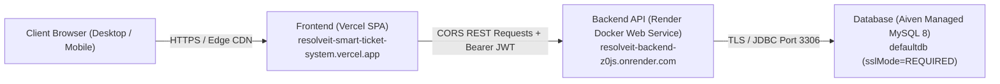

# ResolveIT — Production Deployment Guide (Aiven + Render + Vercel)

This guide documents the full architecture, configuration steps, and operational procedures required to deploy and maintain the **ResolveIT Smart Complaint & Ticket Management System** in production across cloud providers.

---

## 1. Architecture Overview


```mermaid
flowchart LR
    Browser["Client Browser (Desktop / Mobile)"] -->|HTTPS / Edge CDN| Vercel["Frontend (Vercel SPA)<br/>resolveit-smart-ticket-system.vercel.app"]
    Vercel -->|CORS REST Requests + Bearer JWT| Render["Backend API (Render Docker Web Service)<br/>resolveit-backend-z0js.onrender.com"]
    Render -->|TLS / JDBC Port 3306| Aiven["Database (Aiven Managed MySQL 8)<br/>defaultdb (sslMode=REQUIRED)"]
```

- **Frontend (Vercel):** React 18 SPA hosted on **Vercel** with global CDN edge routing and client-side route rewrites via `vercel.json`.
  - **Public Domain:** `https://resolveit-smart-ticket-system.vercel.app`
  - **Legacy Alias:** `https://frontend-sandy-delta-64.vercel.app` (permanently redirects via HTTP 308 to `https://resolveit-smart-ticket-system.vercel.app`)
- **Backend (Render):** Spring Boot 3.3.5 containerized via multi-stage Docker on **Render** (Free tier, Singapore region, auto-sleeps after 15 minutes of inactivity).
  - **Live URL:** `https://resolveit-backend-z0js.onrender.com`
  - **Health Endpoint:** `https://resolveit-backend-z0js.onrender.com/api/health`
- **Database (Aiven):** Managed MySQL 8 on **Aiven** cloud with SSL/TLS encryption enforced (`sslMode=REQUIRED`).

---

## 2. Prerequisites & Accounts

1. **GitHub Repository:** `https://github.com/Ramprasad-Prajapat/resolveit-smart-ticket-system`
2. **Aiven Console:** `https://console.aiven.io/` (Project: `ramprasadprajapat709-500c`)
3. **Render Dashboard:** `https://dashboard.render.com/` (Service: `resolveit-backend`)
4. **Vercel Dashboard:** `https://vercel.com/ramprasad-prajapats-projects` (Project: `resolveit-smart-ticket-system`)

---

## 3. Step 1: Push Code to GitHub

From the local project root (`C:\Resume-Project\resolveit-smart-ticket-system`):

```bash
git push -u origin main
```

- Pushes modifying `frontend/` trigger an automatic build and edge deployment on Vercel.
- Backend deploys on Render are managed manually from the Render dashboard.

---

## 4. Step 2: Aiven MySQL Configuration

1. Log in to the [Aiven Console](https://console.aiven.io/account/a5c9a2562d42/project/ramprasadprajapat709-500c/services).
2. Locate the existing **MySQL** service:
   - Ensure service status is **Running**.
   - Note the connection parameters: **Host**, **Port** (e.g., `14125`), **User** (`avnadmin`), and **Password**.
3. Verify connection over TLS using MySQL CLI:
   ```bash
   mysql -h <host> -P <port> -u avnadmin -p --ssl-mode=REQUIRED
   ```
4. Construct the JDBC connection URL for Render:
   ```
   jdbc:mysql://<host>:<port>/<database>?sslMode=REQUIRED&serverTimezone=UTC
   ```

---

## 5. Step 3: Render Backend Deployment

### Service Settings
- **Service Name:** `resolveit-backend`
- **Environment:** `Docker`
- **Region:** `Singapore (Southeast Asia)`
- **Root Directory:** `backend`
- **Dockerfile Path:** `./Dockerfile`
- **Docker Build Context:** `.`
- **Branch:** `main`
- **Instance Type:** `Free`
- **Health Check Path:** `/api/health`

### Environment Variables on Render

| Variable | Description | Sensitivity |
|---|---|---|
| `DB_URL` | `jdbc:mysql://<host>:<port>/<database>?sslMode=REQUIRED&serverTimezone=UTC` | Secret |
| `DB_USERNAME` | Database username (`avnadmin`) | Secret |
| `DB_PASSWORD` | Database password from Aiven console | Secret |
| `JWT_SECRET` | 256-bit secret key for HMAC-SHA256 JWT signing | Secret |
| `CORS_ORIGINS` | `https://resolveit-smart-ticket-system.vercel.app` | Config |
| `SPRING_DATASOURCE_HIKARI_MAXIMUM_POOL_SIZE` | `5` (preserves connection pool limits on free tier) | Config |
| `JAVA_TOOL_OPTIONS` | `-XX:MaxRAMPercentage=70 -XX:+UseSerialGC` | Config |
| `SEED_ENABLED` | `false` in steady state (`true` on initial setup) | Config |
| `SEED_DEMO_PASSWORD` | Pre-configured demo user password | Secret |

---

## 6. Step 4: Vercel Frontend Deployment & Custom Domains

### Initial Project Setup
1. Log in to the [Vercel Dashboard](https://vercel.com/ramprasad-prajapats-projects).
2. Import repository `Ramprasad-Prajapat/resolveit-smart-ticket-system`.
3. Configure build settings:
   - **Framework Preset:** Vite
   - **Root Directory:** `frontend`
   - **Build Command:** `npm run build`
   - **Output Directory:** `dist`
4. Set Environment Variables:
   - `VITE_API_BASE_URL` = `https://resolveit-backend-z0js.onrender.com/api`
5. Deploy project.

### Managing Production Domains
In Vercel **Project Settings → Domains**:
- Primary production domain: `resolveit-smart-ticket-system.vercel.app` (Target: `Production`, Redirect: `None`, SSL: `Valid Configuration`)
- Legacy domain: `frontend-sandy-delta-64.vercel.app` (Target: `Production`, Redirect: `308 Permanent Redirect` to `resolveit-smart-ticket-system.vercel.app`)

---

## 7. Step 5: CORS Configuration

Backend CORS authorization is driven by the `CORS_ORIGINS` environment variable in Render, parsed by `SecurityConfig.java`:

```properties
app.cors.allowed-origins=${CORS_ORIGINS:http://localhost:5173}
```

### Production CORS Allowlist
```
CORS_ORIGINS=https://resolveit-smart-ticket-system.vercel.app
```

---

## 8. Verifying the Deployment

### Smoke Tests Runbook
- [x] **Backend Health Check:**
  ```bash
  curl -i https://resolveit-backend-z0js.onrender.com/api/health
  # HTTP/1.1 200 OK -> {"status":"UP"}
  ```
- [x] **Frontend Live Access:**
  `https://resolveit-smart-ticket-system.vercel.app` serves HTML, asset bundles (`/assets/index-CWSeh7PI.js`), and valid SSL certificates from Google Trust Services.
- [x] **Domain Redirect:**
  Requests to `https://frontend-sandy-delta-64.vercel.app` (and all subroutes like `/login`) return `HTTP 308 Permanent Redirect` pointing to `https://resolveit-smart-ticket-system.vercel.app`.
- [x] **SPA Direct Routing:**
  Direct navigation and page reloads on `/login`, `/register`, and `/dashboard` succeed with `HTTP 200` via `vercel.json` rewrites.
- [x] **End-to-End Authentication & Workflows:**
  Full login with all five demo roles (`admin@resolveit.com`, `agent1@resolveit.com`, `user1@resolveit.com`), ticket creation, agent status transitions, and audit logs pass verification on `https://resolveit-smart-ticket-system.vercel.app`.

### Cold-Start Behavior (Render Free Tier)
Render spins down free web services after 15 minutes of inactivity:
- Initial requests after idle sleep take **45 to 90 seconds** while the JVM container initializes and establishes MySQL database connection pools.
- Once awake, subsequent API calls respond in **<100ms**.

---

## 9. Rollback & Troubleshooting Runbook

- **Frontend Rollback (Vercel):**
  In Vercel **Deployments**, locate the last healthy deployment, click **... → Promote to Production**. Rollback is instantaneous globally across all attached domains.
- **Frontend Domain Removal:**
  In Vercel **Settings → Domains**, click **Edit** on the domain to remove and click **Remove**.
- **Backend Rollback (Render):**
  In Render **Events**, locate the previous successful deploy and click **Rollback to this deploy**.
- **Database Schema:**
  The production schema is managed by Hibernate JPA (`ddl-auto=update`). In case of connection failure, verify Aiven service state and HikariCP connection pool metrics.
